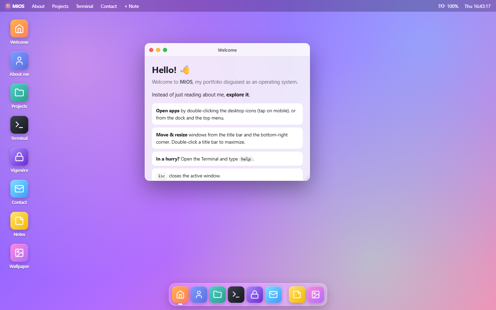
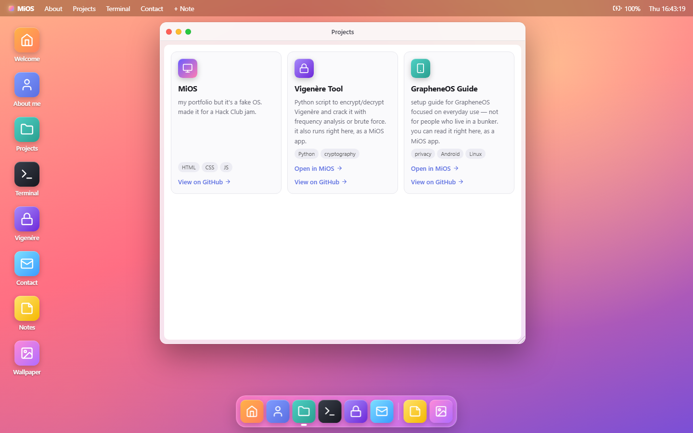
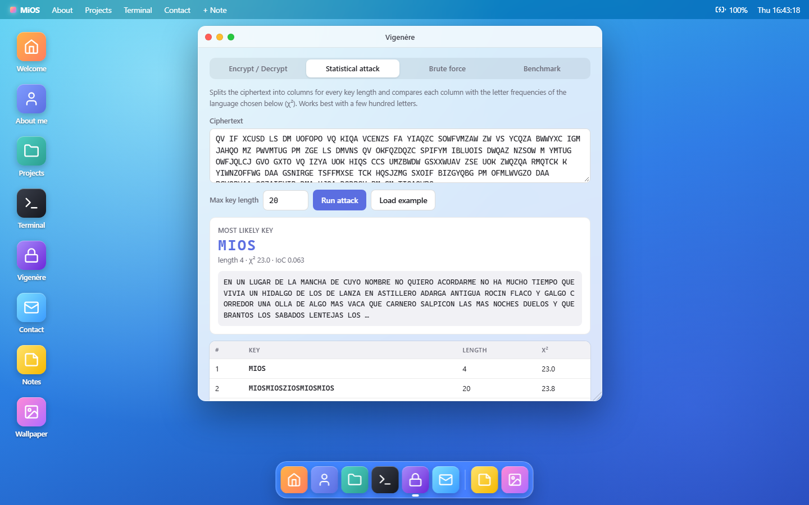

# MiOS  (WebOS 1 — Hack Club)
A browser-based operating system with draggable windows, a live clock, an interactive terminal, and sticky notes. Built with vanilla HTML, CSS, and JavaScript.

---

## Screenshots

| | |
|---|---|
|  |  |
| **Projects** | **Vigenère** — statistical attack recovering the key |

## What's included

- **Boot screen** — logo and spinning dots, once per session (or after `reboot`). Any key or click skips it.
- **Desktop** with app icons (double-click to open, tap on mobile) and switchable CSS-gradient wallpapers.
- **Dock** showing which apps are running and which one is in front.
- **Topbar** with app menu, live clock, and battery (real level in Chrome/Edge, simulated in browsers without the Battery API).
- **Windows** that open/close with animations, stack, minimize, maximize (double-click the title bar), resize from the corner, and remember where you left them.
- **About me** — sidebar + content layout.
- **Projects** — card grid generated from a JS array.
- **Terminal** — interactive shell with a small fake file system. Type `help`.
- **Vigenère** — a JavaScript port of [Pygenère](https://github.com/Ager90/Cifrado-Vigenere-Proyecto): encrypt/decrypt, statistical attack (χ² against Spanish or English letter frequencies, selectable), brute force, and a benchmark that estimates cracking time per key length.
- **GrapheneOS Guide** — my [GrapheneOS setup guide](https://github.com/Er0ga/GrapheneOS-for-normal-usage_privacy-without-paranoia), readable inside MiOS (open it from Projects or with `open grapheneos`).
- **Contact** — GitHub (both accounts) and LinkedIn links.
- **Wallpaper** — pick a wallpaper; it's saved for your next visit.
- **Sticky notes** *(custom feature)* — draggable, resizable, editable notes saved in your browser. Create them from the topbar, the dock, the desktop, or with `note` in the terminal.
- Works on mobile (touch dragging, windows open full-screen) and with the keyboard (`Esc` closes the active window).

## Running it

No build step and no dependencies: open `index.html` in a browser, or serve the folder with any static server (for example `python -m http.server`). It also works as-is on GitHub Pages.

## Terminal commands

`help`, `about`, `whoami`, `projects`, `skills`, `contact`, `neofetch`,
`ls [dir]`, `cd <dir>`, `pwd`, `cat <file>`, `open <app>`, `wallpaper [name]`,
`vigenere enc|dec <key> <text>`, `vigenere crack <ciphertext>`, `vigenere example`, `note`, `history`, `date`, `echo <text>`, `clear`, `reboot`

- `Tab` autocompletes commands, apps, wallpapers, and file paths.
- `↑` / `↓` repeat previous commands, `Ctrl+L` clears the screen.

